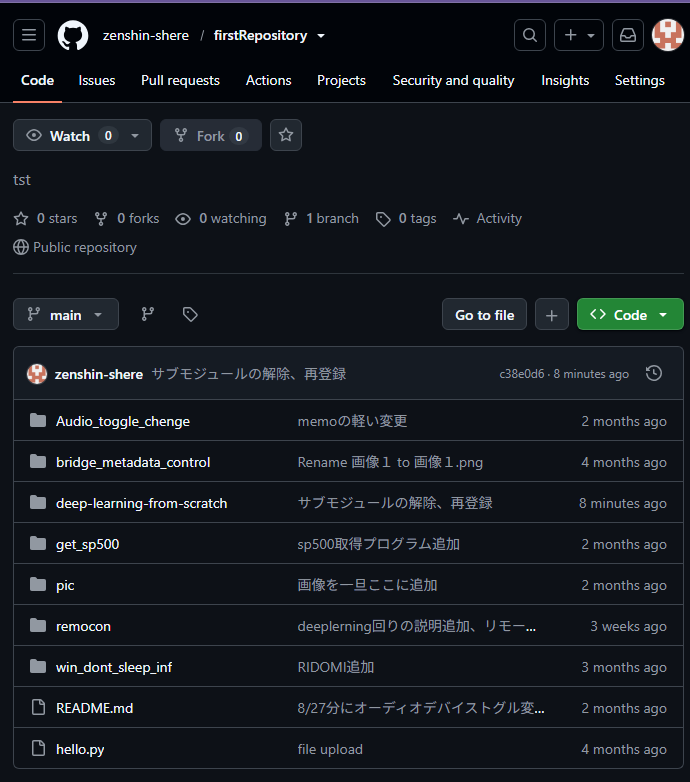

【当該フォルダのデータが別pcでダウンロードできない問題の解決】  
原因：以前書籍データをクローンした際に行ったサブモジュール化

サブモジュール → 別のリポジトリをリンク(参照)として埋め込む機能

原因2：サブモジュールフォルダ内にmy_fileというフォルダを作成したが、
gitの設計思想的に良くなかった。

解決：問題のフォルダ(deep-leaning-from-scratch)のサブモジュールを解除。  
解決2：自作フォルダ(deep-leaning-from-scratch_myfile)を作成しそちらで自分のデータを管理する。

    工程①：gitの連携を外す
        git rm --cached path/to/submodule
            gitでrm(リムーブ=削除)
            --cached オプション用の接頭辞、git上でのリンクのみを削除したいのでつける
            path/to/submodule 消したいフォルダのパス

    工程②：残ったgit残骸ファイルの排除
        .gitのついたフォルダの削除

    工程③：gitにaddする
        このままgitをpushしても幽霊のようなフォルダが増えるだけだったので、当該フォルダをgitにリンクさせる。
        git add path/to/submodule
        あとはいつも通りにコミットとプッシュを行う。

【メモのシステムを更新】  
画像表示はできた方が見やすいのでメモをマークダウン方式(memo.txt→memo.md)に変更。  
下記のような特殊な表記をすることでメモに下記のような画像が表示されるようになる。  
md(マークダウン)はブログなどでも使われる記法で、web上での表示に便利。

    

    